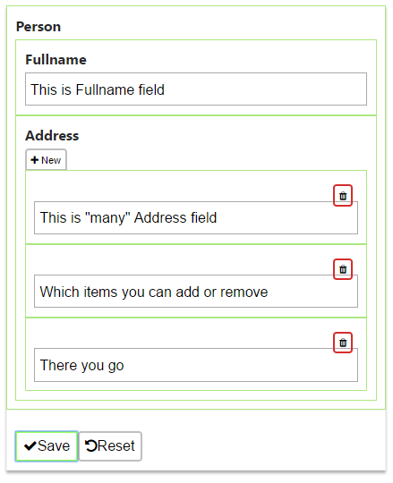

# Caretaker v0.1.0-beta
A Javascript library for making a new breed of structured HTML5 Form

## What is Caretaker?

> _HTML5 Form, the new breed._

Caretaker is a React based Javascript library which enables a structured HTML5 Form which yields structured data from the fields.

Utilizing JSON, FormData HTTP ContentType, and React, Caretaker creates a declarative programming experience, eliminating the hassle of making form views, giving developers more chance to focus in business processes.

With Caretaker, this JSON:

```Javascript
{
	type: "object",
	name: "person",
	label: "Person",
	has: [
		{
			type: "text",
			name: "fullname",
			label: "Fullname"
		},
		{
			type: "text",
			name: "address",
			label: "Address",
			quantity: "many"
		}
	]
}
```

can create this form:



and thus, the form will returns the following data on submit:

```Javascript
{
  "fullname": "This is Fullname field",
  "address": [
    "This is \"many\" Address field",
    "Which items you can add or remove",
    "There you go"
  ]
}
```

## Getting Started

### Prerequisites

Caretaker **needs** the following libraries to run:

- ES6 Promise Polyfill: [Github](https://github.com/stefanpenner/es6-promise) [CDN](https://cdnjs.com/libraries/es6-promise)
- Fetch Polyfill: [Github](https://github.com/github/fetch) [CDN](https://cdnjs.cloudflare.com/ajax/libs/fetch/2.0.3/fetch.js)
- Moment: [Website](https://momentjs.com) [Github](https://github.com/moment/moment) [CDN](https://cdnjs.com/libraries/moment.js/)
- React and ReactDOM: [Website](https://facebook.github.io/react/) [Github](https://github.com/facebook/react) [CDN](https://cdnjs.com/libraries/react)

And for styling (not neccessary to work but it is better when included)

- FontAwesome: [Website](http://fontawesome.io/) [Github](https://github.com/FortAwesome/Font-Awesome) [CDN](https://cdnjs.com/libraries/font-awesome)

### Creating Forms

Caretaker needs a container:

```HTML
<div id="the-form-container"></div>
```

And a model, for example, a form for a new user needs firstname, lastname, and a profile picture:

```HTML
<script>
var userModel = {
 type: "object",
 name: "user",
 label: "New User",
 description: "Register a new user",
 has: [
  {
   type: "text",
   name: "firstname",
   placeholder: "First name",
   required: true
  },
  {
   type: "text",
   name: "lastname",
   placeholder: "Last name",
   required: true
  },
  {
   type: "image",
   name: "profile_picture",
   label: "Profile Picture"
  }
 ]
}
</script>
```

Finally, make the form with some parameters

```HTML
<script>
 var newUserForm = Caretaker.makeForm({
  edit: userModel,
  resettable: true,
	action: "https://url_you_want_the_form_to_send_data.to",
	afterSuccess: function(response, formdata){
		// response is Response Object see https://developer.mozilla.org/en-US/docs/Web/API/Response
		// formdata is FormData Object see https://developer.mozilla.org/en/docs/Web/API/FormData

		// things you want to do after success
		window.location.href = "https://success.url"
	}
}, 'the-form-container')
</script>
```

The `<form>` then will be rendered inside the `<div id="the-form-container"></div>`

## Parameters

### Model Parameters

- ###### "type" _(mandatory, case-sensitive)_
	Possible values:
	- "object" or null
	- Standard `<input>` type attribute such as : "text", "number", "date", "time", "file", "checkbox", "radio", "hidden", etc
	- Custom Input such as : "select", "textarea", "textarea-html"
	- Pre-extended Input (see [Extension](#extension)) such as : "image"
	- Any String that has been registered as _Caretaker Extension_ (see [Extension](#extension))

- ###### "name" _(mandatory, case-sensitive)_
	Possible values:
	- Any String
	- For the root Object, name:"files" is forbidden as it is a reserved word for the Caretaker to use.

- ###### "label" _(optional)_
	Possible values:
	- String

- ###### "description" _(optional)_
	Possible values:
	- String

- ###### "quantity" _(optional, case-sensitive)_
	Possible values:
	- "many" : will trigger the addable/removable "many" object fields

- ###### "maxCount" _(optional)_
	Possible values:
	- Any number more than or same as minCount: Only works with "quantity": "many"

- ###### "minCount" _(optional)_
	Possible values:
	- Any number less than or same as maxCount: Only works with "quantity": "many"

- ###### "defaultValue" _(optional)_
	Possible values:
	- Any value that works with the input type

- ##### "className" _(optional)_ _(*NEW)_
	Used to add className besides other default ClassNames, such as: every caretaker form object has className="CaretakerFormObject". By passing {'.CaretakerFormObject': "added-class another-added-class"}, the printed value will be className="CaretakerFormObject added-class another-added-class".
	Possible values:
	- Objects with attributeKeys same as default caretaker classNames or tagname. ClassName must be preceeded by a fullstop sign ".". attributeKeys examples: ".CaretakerFormObject", ".CaretakerLabel", ".CaretakerForm", "div", "select" 

- ###### "required" _(optional)_
	Possible values:
	- Boolean: marks that the input must be filled

- ###### Other possible parameters
	Such as:
	- values: value-text pair object for input types: "select", "checkbox", or "radio"
	```
	{
		type: "radio",
		name: "gender",
		values: {
			"male": "Male",
			"female": "Female"
		}
	}
	```

### Form Parameters

- ###### "edit" _(mandatory)_
	Possible values:
	- Caretaker form model

- ###### "action" _(mandatory)_
	Possible values:
	- Url (String) where data will be posted
	- Function(formdata) action that will be executed when save button is clicked

- ###### "submittable" _(optional)_
	Possible values:
	- Boolean

- ###### "resettable" _(optional)_
	Possible values:
	- Boolean

- ###### "afterSuccess" _(optional)_
	Possible values:
	- Function(response, formdata): function will be executed after action is performed when response is ok (status = 200). For more information about Response Object, ([see Response](https://developer.mozilla.org/en-US/docs/Web/API/Response))

- ###### "afterFailure" _(optional)_
	Possible values:
	- Function(err, formdata): function will be executed after action is performed when response is not ok (status != 200) or when fetch encountered error. For more information about Response Object, (([see Response](https://developer.mozilla.org/en-US/docs/Web/API/Response)))

- ###### "afterAction" _(optional)_
	Possible values:
	- Function(formdata): function will be executed after action is performed regardless of whether the action suceeded or failed

## Return Value

Caretaker Form will send "multipart/form-data" content type to wherever the String "action" says (e.g. action:"https://www.yoursite.com/post_data"). The data will be attached to the **"name" attribute of the root Caretaker Input Object**.

For example, the form on the [Creating Forms](#creating-forms) of the page will results a request Payload, which contains JSON and Files (if you uploaded any file):

```
Content-Disposition: form-data; name="user"

{"firstname":"Alan", "lastname":"Darmasaputra", "profile_picture": {"_is_caretaker_uploaded_file":true, "name":"filename.ext", "size":14203, "index":0}}

Content-Disposition: form-data; name="files"; filename="filename.ext"
Content-Type: application/vnd.openxmlformats-officedocument.wordprocessingml.document
```

Which will be available as "user" and "files".

In PHP you can use:

```php
$files = $_FILES['files'];
$user = json_decode($_POST['user']);

$user_profile_picture = $files[ $user->profile_picture->index ];
```

Or in node.js with Express and Multer:

```javascript
app.post(url, multerObject.any(), function(req, res){
	var user = JSON.parse(req.body.user)
	var user_display = req.files[user.profile_picture.index]
})
```

Note: Files uploaded will be put in the array `files`. The main body, which is a JSON string, will only contain fileData Object in place of the supposed file. The fileData Object has `index` attribute which points to the index the supposed file is stored in the array `files`

## Extension

Coming soon. If you're interested, see _[src_extension/caretaker_form_input_image.js](src_extension/caretaker_form_input_image.js)_

## Planned Features

- [x] Extension - Image input
- [x] Custom Object Classname
- [ ] Custom HTML Object Label
- [ ] Custom HTML Object Description
- [ ] Conditional Supplement Input Object (Additional child input that shows when an object's value meets certain conditions)
- [ ] Caretaker View - New breed of HTML views
- [ ] Extension - Select Object - Works like select. Available values are being showed as object with modifiable structure
- [ ] Extension Documentation - How to extend Caretaker Input

## Project Status

Currently, Caretaker is in testing phase. My team at work is building projects using Caretaker. Bugs are being exterminated, potential features are being considered.

## License

[Apache-2.0](https://choosealicense.com/licenses/apache-2.0/)
